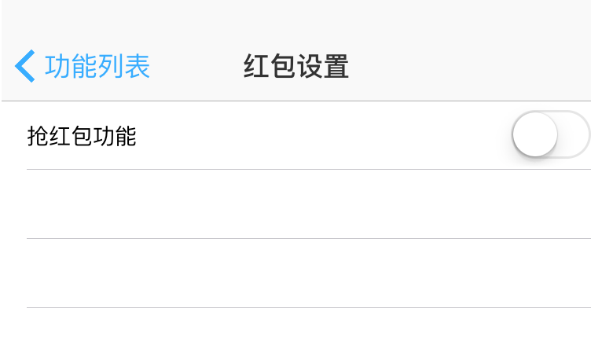

# 源码说明

## 分析工程的Tweak 目录
这个目录中的tweak,是我分析钉钉流程中使用的,作用就是将我觉得可能的类中的方法都加上Log,这样我们就可以根据log日志来分析钉钉的抢洪波啊的流程,如果你需要自己分析流程,那么这个工程适合你.对于电脑上安装了theos环境的来说.更改目录下makefile文件中的THEOS_DEVICE_IP = 10.0.45.93为你自己的手机的ip.  
然后执行命令 make package install,就可以将其安装到越狱的手机上来进行输出日志,从而分析了.


## DingTalkNoJailTweak.xcodeproj工程
这个用来方便的查看代码的.虽然它也可以用来生成动态链接库,但是这里我提供了一个脚本 build_dylib.sh来生成自动抢红包的逻辑的dylib.

## 越狱加载抢红包插件的tweak 目录
这个tweak是用来在越狱手机上加载build_dylib.sh生成的抢红包的dylib的.编译方式,同第一个.   
 不过要先运行build_dylib.sh生成dylib.然后将生成的 bin/univesal/libDingTalkNoJailTweak.ydlib拷贝到 越狱加载抢红包插件的tweak/layout/Library/Application Support/DingDing/目录下
对于电脑上安装了theos环境的来说.更改目录下makefile文件中的THEOS_DEVICE_IP = 10.0.45.93为你自己的手机的ip.  
然后执行命令 make package install,就可以将其安装到越狱的手机上.一旦安装了,打开钉钉,会出现一个菜单  

  

点击菜单,就出现了自动抢红包的控制开关了  

  

打开开关,自动抢红包就起作用了


### 钉钉抢红包非越狱版的制作

1、从 PP助手下载或者从一个越狱手机上砸壳后获取砸过壳钉钉 (飞越狱插件需要修改钉钉的二级制可执行文件,有壳的(appstore下载的)是无法修改的)

2、编写钉钉抢红包的代码(这里就是此工程) ,cd 到 `build_dylib.sh` 目录下， 运行脚本 `build_dylib.sh` 就可以生成用来嵌入微信二进制的通用的动态链接库 `libDingTalkNoJailTweak.dylib` 

3、将1、得到的砸了壳的钉钉,解压缩这个ipa文件,将libDingTalkNoJailTweak.dylib拷贝其解压后的钉钉的app文件夹中,和DingTalk同级目录.

4、使用brew安装optool或者[optool](https://github.com/alexzielenski/optool) ，这个项目包含了另外的子项目，[ArgumentParser](https://github.com/mysteriouspants/ArgumentParser.git)，ArgumentParser又包含子项目 [CoreParse](https://github.com/beelsebob/CoreParse.git)，记得修改ArgumentParser中CoreParse的代码地址（ArgumentParser配置的有问题）来自己编译optool.

5、利用optool来修改钉钉的可执行文件DingTalk  
```shell
optool install -c load -p "@executable_path/libDingTalkNoJailTweak.dylib" -t DingTalk.app/DingTalk
```
这里的@executable_path表示的是可执行文件所在的目录,这也就是为什么3、中将将libDingTalkNoJailTweak.dylib拷贝其解压后的钉钉的app文件夹中,和DingTalk同级目录的原因.

 （记得 `@executable_path` 不能缺少,也不要改成其他的.）

6、使用企业版账号随便archive一个应用,将其中的embedded.mobileprovision文件拷贝出来,放到钉钉文件夹下,和DingTalk同级目录,一定要记得 需要这个 `embedded.mobileprovision` 文件,如果没有这个文件,重签名后是安装不了的

7、重签名 这一步可以使用图形化工具 [ios-app-signer源码](https://github.com/DanTheMan827/ios-app-signer)   [ios-app-signer下载](http://dantheman827.github.io/ios-app-signer/)  得到新的ipa安装包

8、利用iTool Pro或者PP助手等,安装制作好的ipa即可!


